hello this is # CampusNet: An Interactive University Community Platform

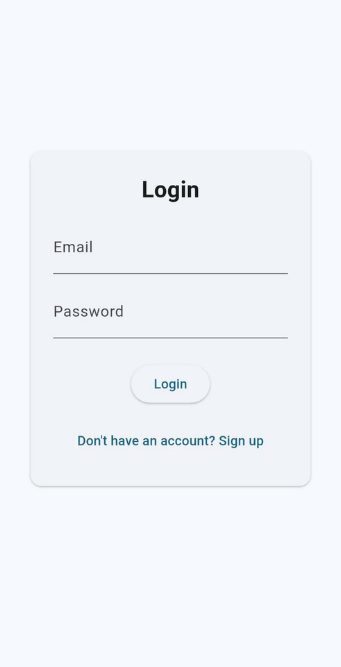

CampusNet is a comprehensive mobile application designed to connect students, alumni, and faculty members within a unified digital ecosystem. Built with Flutter and powered by a robust Flask backend, this platform transforms the way university communities interact, share resources, and access essential services.

## 🌟 Project Overview

CampusNet addresses the fragmented digital experience faced by university students by bringing together essential campus services into one cohesive platform. From AI-powered assistance to emergency services, from academic resource sharing to social networking, CampusNet creates a seamless digital campus experience.

**Target Users:**
- Undergraduate Students
- Graduate Students  
- Alumni
- Faculty Members

## 🎯 Key Features

### 1. NetBot - AI-Powered Campus Assistant

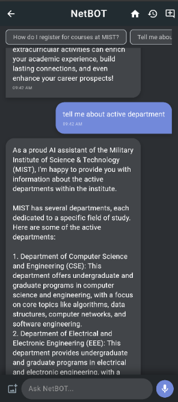
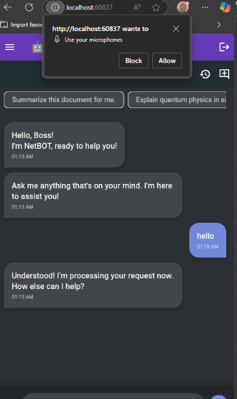
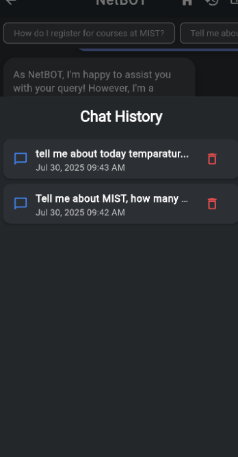

NetBot is our intelligent campus assistant powered by advanced AI technology. It provides instant answers to campus-related questions, academic guidance, and personalized assistance.

**Features:**
- **Conversational AI:** Natural language processing for intuitive interactions
- **Voice Input Support:** Speech-to-text functionality for hands-free operation
- **Institutional Knowledge Base:** Trained on MIST-specific information including academics, admissions, campus facilities, and policies
- **Context-Aware Responses:** Maintains conversation history and provides relevant follow-up information
- **Multi-Modal Support:** Text, image, and voice input capabilities
- **Session Management:** Organized chat history with searchable conversations
- **Personalized Assistance:** Tailored responses based on user profile and academic standing

**Technical Implementation:**
- RAG (Retrieval-Augmented Generation) architecture for accurate information retrieval
- Vector embeddings using pgvector for semantic search
- Groq API integration for fast response generation
- Real-time processing with session persistence
- Document processing pipeline for institutional knowledge updates

### 2. Interactive Campus Map

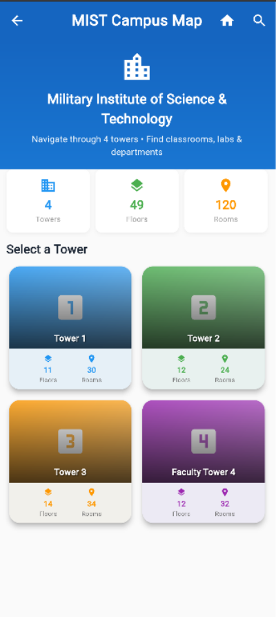
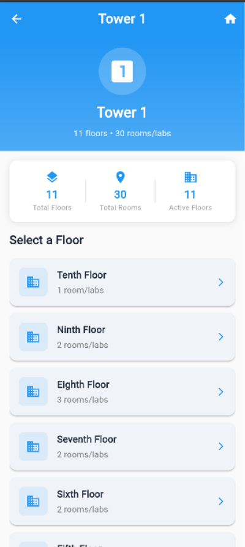
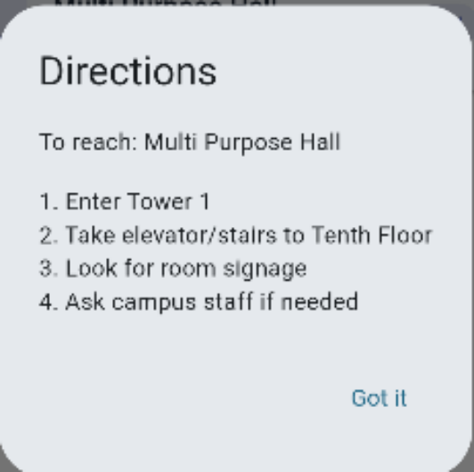
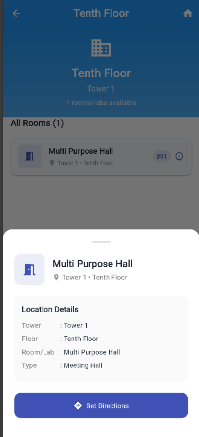

Navigate the campus with confidence using our comprehensive interactive mapping system.

**Features:**
- **Building Directory:** Complete listing of all campus buildings and facilities
- **Floor Plans:** Detailed layouts for each building with room-specific information
- **Smart Search:** Find classrooms, offices, labs, and facilities instantly
- **Turn-by-Turn Directions:** Step-by-step navigation within the campus
- **Points of Interest:** Cafeterias, libraries, recreational areas, and emergency facilities
- **Accessibility Information:** Wheelchair access and accessibility features mapping
- **Real-Time Updates:** Dynamic information about room availability and facility status

**Navigation Features:**
- Interactive floor selection with zoom capabilities
- Quick location lookup with autocomplete
- Shortest path calculation between locations
- Campus facility categorization and filtering
- Offline map caching for uninterrupted access

### 3. Advanced Messaging System

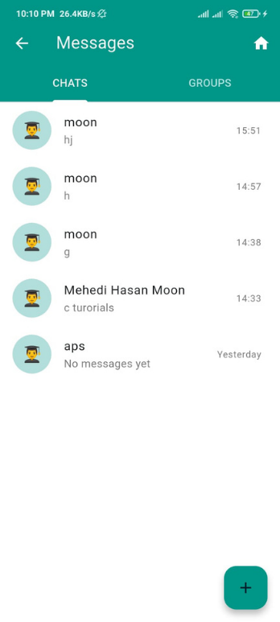
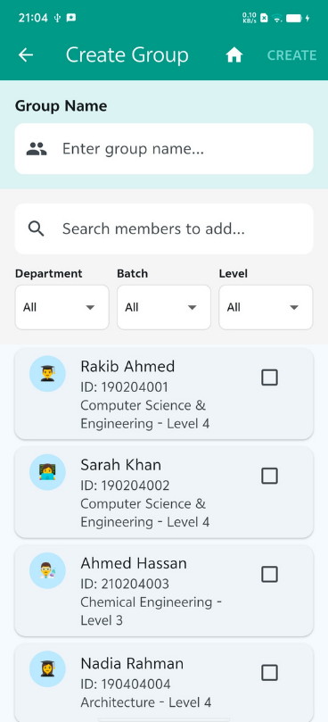
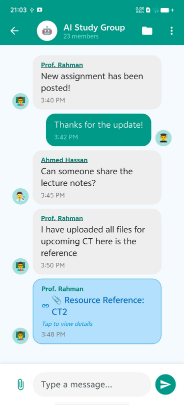
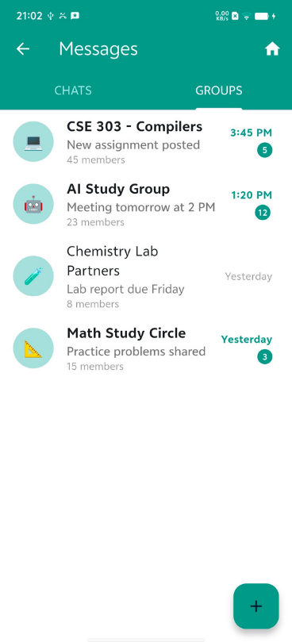
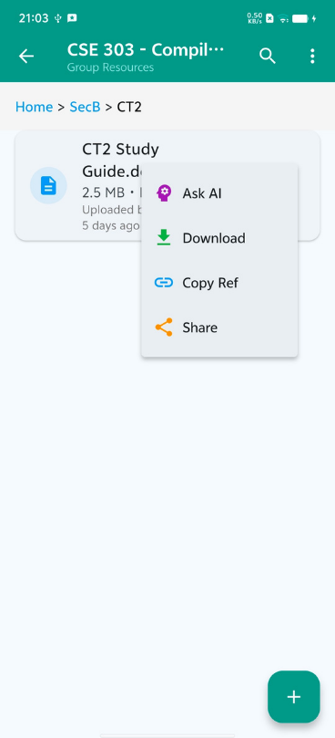

A sophisticated messaging platform that facilitates communication and collaboration within the university community.

**Core Messaging Features:**
- **Individual Chats:** Direct messaging between users with real-time delivery
- **Group Conversations:** Multi-participant discussions with admin controls
- **Media Sharing:** Share images, documents, and files seamlessly
- **Message Status:** Read receipts and delivery confirmations
- **Search Functionality:** Find conversations and messages quickly
- **User Filtering:** Search contacts by department, level, session, and designation

**Group Management:**
- **Role-Based Access:** Admin, moderator, and member permissions
- **Group Customization:** Custom names, avatars, and descriptions
- **Participant Management:** Add/remove members with appropriate permissions
- **Group Analytics:** Message statistics and activity tracking

**Group Resource System:**
Teachers and group administrators can create dedicated resource sharing spaces within groups where they can:
- **Upload Academic Materials:** Share CT results, mid-term exam papers, assignment guidelines
- **Organize Content:** Create folder structures for different subjects and topics
- **Reference Sharing:** Pass direct references to important materials within chat conversations
- **Version Control:** Track document updates and maintain revision history
- **Access Control:** Manage who can view, download, or upload specific resources

**Technical Implementation:**
- Real-time messaging with WebSocket support
- File upload with secure storage and virus scanning
- Database optimization for large conversation histories
- Push notifications for message delivery
- End-to-end encryption for sensitive communications

### 4. Resource Bank - Academic Material Hub

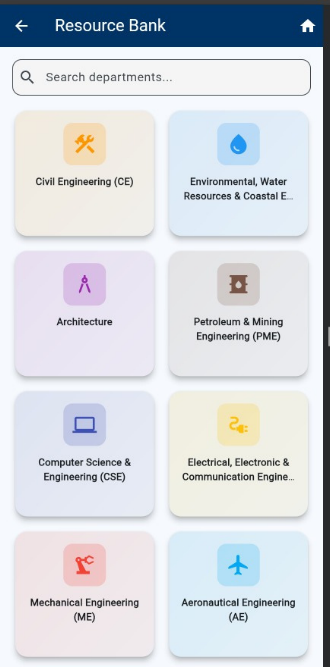
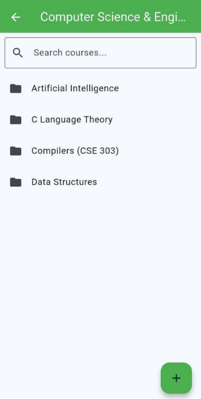
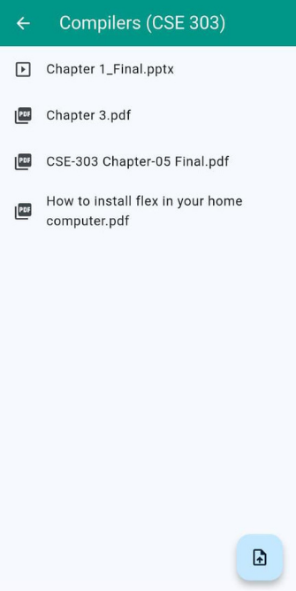

A centralized repository for academic resources organized by departments, courses, and chapters.

**Features:**
- **Department-Based Organization:** Materials organized by academic departments
- **Course-Specific Content:** Resources categorized by individual courses
- **Chapter-Level Detail:** Granular organization for easy content discovery
- **Multi-Format Support:** PDFs, images, documents, presentations, and videos
- **Search and Filter:** Advanced search with filters for file type, upload date, and popularity
- **User Contributions:** Students and faculty can upload and share materials
- **Quality Control:** Moderation system to ensure content relevance and quality
- **Download Analytics:** Track popular resources and usage patterns

**Content Management:**
- File versioning and update notifications
- Duplicate detection and automatic organization
- Bandwidth optimization for large file downloads
- Mobile-optimized viewing for various file formats
- Collaborative annotations and comments on resources

### 5. Tuition Services Platform

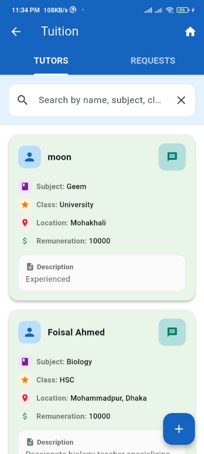
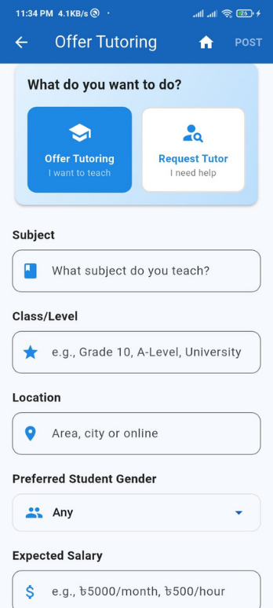
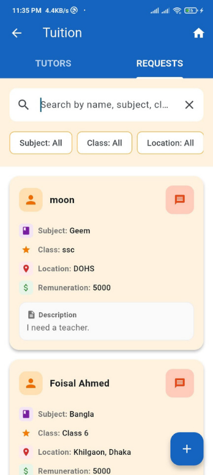

Connect tutors with students through an intelligent matching platform.

**Features:**
- **Dual Functionality:** Both tutor offering and student requesting capabilities
- **Smart Matching:** Algorithm-based matching based on subject, location, and requirements
- **Detailed Profiles:** Comprehensive information about tutors' qualifications and experience
- **Rating System:** Peer reviews and ratings for quality assurance
- **Communication Tools:** Direct messaging between tutors and students
- **Scheduling Integration:** Built-in calendar for session planning
- **Payment Tracking:** Optional payment management and history

**AI-Powered Enhancement:**
One of the standout features is the **AI Auto-Refine** functionality that helps users create better tuition posts:
- **Content Enhancement:** Automatically improves grammar, spelling, and structure of tuition descriptions
- **Professional Formatting:** Transforms casual descriptions into professional, compelling posts
- **Keyword Optimization:** Suggests relevant keywords to improve post visibility
- **Template Suggestions:** Provides structure recommendations based on successful posts
- **Real-Time Processing:** Instant refinement using advanced language models
- **Contextual Improvements:** Maintains the original meaning while enhancing clarity and professionalism

**Advanced Features:**
- Verification badges for experienced tutors
- Subject-specific skill assessments
- Location-based matching with distance calculations
- Availability calendar integration
- Success story sharing and testimonials

### 6. Emergency Services Hub


A comprehensive emergency response system for the campus community.

**Blood Bank System:**
- **Donor Registration:** Easy registration for blood donors with medical history
- **Blood Request Management:** Create and manage urgent blood requests
- **Smart Matching:** Automatic matching of blood requests with compatible donors
- **Emergency Notifications:** Instant alerts for critical blood requirements
- **Location-Based Search:** Find nearby donors and blood banks
- **Medical History Tracking:** Maintain donation history and eligibility status
- **Emergency Contact Integration:** Quick access to emergency contacts and medical facilities

**Ambulance Services:**
- **Quick Access:** One-tap access to ambulance services
- **Location Sharing:** Automatic location sharing for emergency response
- **Hospital Directory:** List of nearby hospitals and medical facilities
- **Emergency Contacts:** Pre-configured emergency contact numbers
- **Medical Information:** Quick access to user's medical information for first responders

**Safety Features:**
- Campus security contact integration
- Anonymous reporting system for safety concerns
- Real-time emergency broadcasts
- Crisis response protocols and guidelines

### 7. Social Feed and Blog Platform

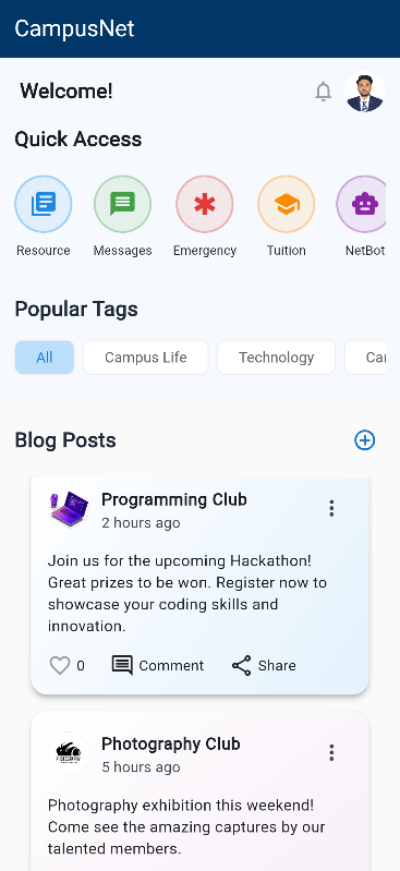
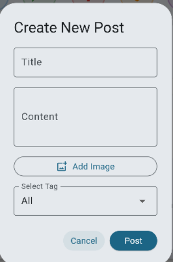


Foster community engagement through social features and content sharing.

**Features:**
- **Social Posts:** Share updates, achievements, and campus life moments
- **Blog Creation:** Long-form content creation with rich text editing
- **Tag System:** Organize content with relevant tags and categories
- **Comment System:** Interactive discussions on posts and blogs
- **Like and Share:** Social engagement features
- **Content Moderation:** Community guidelines enforcement
- **Trending Topics:** Popular content discovery
- **User Following:** Connect with friends and interesting community members

**Content Discovery:**
- Personalized feed based on interests and connections
- Trending hashtags and topics
- Event announcements and campus news
- Club and organization updates
- Academic achievement celebrations

### 8. Comprehensive Profile System

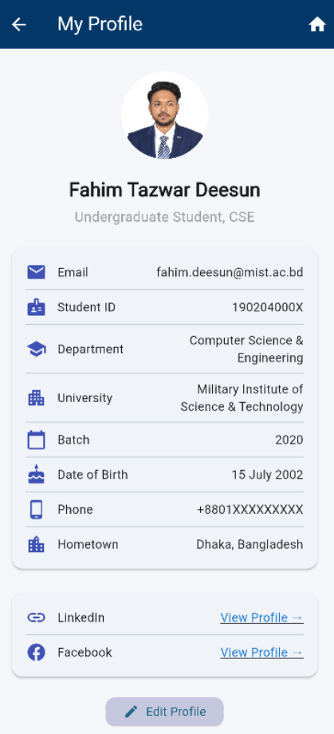
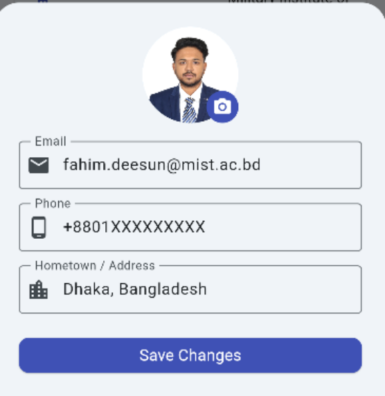

Detailed user profiles that serve as digital identity cards within the campus community.

**Profile Features:**
- **Personal Information:** Complete student/faculty information with verification
- **Academic Details:** Department, level, session, CGPA, and academic achievements
- **Professional Links:** LinkedIn, GitHub, portfolio integration
- **Skills Showcase:** Technical and soft skills with peer endorsements
- **Achievement Gallery:** Awards, certifications, and recognitions
- **CV Generator:** Automated CV creation with professional templates
- **Privacy Controls:** Granular privacy settings for different information types

**CV Generation System:**
- **Multiple Templates:** Professional CV templates for different purposes
- **Auto-Population:** Automatic data population from profile information
- **Custom Sections:** Add projects, experiences, and achievements
- **Export Options:** PDF and other format exports
- **Version Management:** Multiple CV versions for different applications
- **Template Customization:** Personalize colors, fonts, and layouts

## 🛠️ Technology Stack

### Frontend
- **Framework:** Flutter (Dart)
- **State Management:** Provider/Riverpod
- **HTTP Client:** Dio/http package
- **Local Storage:** SharedPreferences/Hive
- **Media Handling:** Image picker, camera integration
- **Voice Recognition:** Speech-to-text packages
- **Maps Integration:** Custom map implementation
- **Push Notifications:** Firebase Cloud Messaging

### Backend
- **Framework:** Flask (Python)
- **Database:** PostgreSQL with pgvector extension
- **ORM:** SQLAlchemy
- **Authentication:** JWT (JSON Web Tokens)
- **File Storage:** Local storage with S3-compatible backup
- **Vector Database:** pgvector for AI embeddings
- **API Documentation:** Flask-RESTX/Swagger
- **Task Queue:** Celery for background processing

### AI and Machine Learning
- **Language Model:** Groq API with LLaMA 3.3 70B
- **Embeddings:** Sentence Transformers (all-MiniLM-L6-v2)
- **Vector Search:** pgvector with cosine similarity
- **RAG Pipeline:** Custom implementation for institutional knowledge
- **Text Processing:** spaCy for natural language processing
- **Content Refinement:** GPT-based text enhancement

### DevOps and Infrastructure
- **Containerization:** Docker
- **Database Management:** PostgreSQL with vector extensions
- **File Management:** Secure file upload and storage
- **Backup Systems:** Automated database and file backups
- **Security:** JWT authentication, input validation, SQL injection protection

## 🏗️ System Architecture

### Database Design
The application uses a sophisticated database schema with the following key models:

**User Management:**
- Users: Core user information and authentication
- Profiles: Extended user profiles with achievements and skills
- Authentication: JWT-based session management

**Messaging System:**
- Conversations: Individual and group chat containers
- ConversationParticipants: User membership in conversations
- Messages: Message content with support for different types
- MessageReads: Read receipt tracking
- GroupFolders: Hierarchical folder structure for group resources
- GroupFiles: File storage and metadata for group resources

**Academic Resources:**
- Departments: Academic department information
- Courses: Course details linked to departments
- Notes: Academic materials and resources
- DocumentEmbeddings: Vector embeddings for AI search

**Community Features:**
- SocialPosts: Blog posts and social updates
- SocialTags: Content categorization
- Comments: Discussion system
- Reactions: Like and interaction system

**Emergency Services:**
- Donors: Blood donor registration and information
- BloodRequests: Blood requirement postings
- DonationHistory: Track donation activities

**AI System:**
- ChatSessions: AI conversation management
- ChatMessages: AI interaction history
- InstitutionalKnowledge: University-specific information base
- DocumentEmbeddings: Vector storage for semantic search

### API Architecture
RESTful API design with clear endpoint organization:

- `/api/auth/*` - Authentication and user management
- `/api/messages/*` - Messaging and group communication
- `/api/social/*` - Social posts and community features
- `/api/study-materials/*` - Academic resource management
- `/api/tuition/*` - Tuition service management
- `/api/blood/*` - Emergency and blood bank services
- `/api/ai/*` - AI chatbot and text processing
- `/api/profile/*` - User profile management
- `/api/group-resources/*` - Group file and folder management

## 🚀 Getting Started

### Prerequisites
- Flutter SDK (>=3.0.0)
- Python 3.8+
- PostgreSQL with pgvector extension
- Node.js (for development tools)
- Git

### Backend Setup

1. **Clone the repository:**
```bash
git clone https://github.com/moonmehedi/CampusNet.git
cd CampusNet/backend
```

2. **Create virtual environment:**
```bash
python -m venv venv
source venv/bin/activate  # On Windows: venv\Scripts\activate
```

3. **Install dependencies:**
```bash
pip install -r requirements.txt
```

4. **Set up environment variables:**
```bash
cp .env.example .env
# Edit .env file with your configuration
```

5. **Configure database:**
```bash
# Create PostgreSQL database with pgvector
createdb campusnet
psql campusnet -c "CREATE EXTENSION vector;"
```

6. **Initialize database:**
```bash
python init_database.py
python init_knowledge_base.py
```

7. **Run the backend:**
```bash
python app.py
```

### Frontend Setup

1. **Navigate to frontend directory:**
```bash
cd ../Front-end
```

2. **Install Flutter dependencies:**
```bash
flutter pub get
```

3. **Update configuration:**
```dart
// lib/config.dart
class Config {
  static const String baseUrl = 'http://your-backend-url:5000';
  // Update other configuration as needed
}
```

4. **Run the application:**
```bash
flutter run
```

### Development Setup

1. **Install development tools:**
```bash
# Backend tools
pip install black flake8 pytest

# Frontend tools
flutter pub get
dart pub global activate flutter_launcher_icons
```

2. **Set up pre-commit hooks:**
```bash
# Python code formatting
pre-commit install
```

3. **Database migrations:**
```bash
# Run database migrations
flask db upgrade
```

## 📱 Mobile App Features

### Cross-Platform Compatibility
- **iOS Support:** Native iOS experience with platform-specific optimizations
- **Android Support:** Material Design implementation with Android-specific features
- **Responsive Design:** Adaptive layouts for different screen sizes
- **Offline Capabilities:** Core features available offline with data synchronization

### Performance Optimizations
- **Lazy Loading:** Efficient content loading for better performance
- **Image Caching:** Smart image caching and compression
- **Background Sync:** Automatic data synchronization in background
- **Battery Optimization:** Efficient battery usage with background task management

### Security Features
- **Secure Authentication:** JWT-based authentication with refresh tokens
- **Data Encryption:** End-to-end encryption for sensitive communications
- **Secure File Upload:** Virus scanning and file validation
- **Privacy Controls:** Granular privacy settings for user data

## 🔒 Security and Privacy

### Data Protection
- **GDPR Compliance:** European data protection regulation compliance
- **User Consent:** Clear consent mechanisms for data collection
- **Data Minimization:** Collect only necessary user information
- **Right to Deletion:** User data deletion capabilities

### Security Measures
- **Input Validation:** Comprehensive input sanitization
- **SQL Injection Protection:** Parameterized queries and ORM usage
- **XSS Prevention:** Content Security Policy and output encoding
- **Rate Limiting:** API rate limiting to prevent abuse
- **Secure Headers:** Security headers for web protection

### Privacy Features
- **Anonymous Options:** Anonymous posting and feedback options
- **Visibility Controls:** Control who can see profile information
- **Communication Preferences:** Manage notification and messaging preferences
- **Data Export:** Export personal data in standard formats

## 🤖 AI Integration

### Natural Language Processing
The AI system leverages advanced natural language processing capabilities:

**Institutional Knowledge Base:**
- Comprehensive information about MIST policies, procedures, and facilities
- Academic program details, course information, and requirements
- Admission guidelines and application processes
- Campus services and facility information
- Research opportunities and academic resources

**RAG Implementation:**
- **Document Processing:** Automated processing of institutional documents
- **Vector Embeddings:** Semantic search using sentence transformers
- **Context Retrieval:** Relevant context retrieval for accurate responses
- **Response Generation:** Context-aware response generation using LLaMA 3.3

**AI-Powered Features:**
- **Text Refinement:** Automatic improvement of user-generated content
- **Smart Search:** Semantic search across all platform content
- **Personalized Recommendations:** Content and connection recommendations
- **Automated Tagging:** Intelligent content categorization

### Machine Learning Pipeline
- **Continuous Learning:** Model improvement based on user interactions
- **Feedback Integration:** User feedback incorporation for better responses
- **Performance Monitoring:** Real-time monitoring of AI system performance
- **A/B Testing:** Experimental features testing for optimization

## 📈 Analytics and Insights

### User Analytics
- **Engagement Metrics:** Track user interaction and engagement patterns
- **Feature Usage:** Monitor which features are most popular
- **Performance Analytics:** App performance and load time monitoring
- **Crash Reporting:** Automatic crash detection and reporting

### Content Analytics
- **Popular Content:** Track trending posts and resources
- **Search Analytics:** Most searched terms and topics
- **Resource Usage:** Academic resource download and view statistics
- **Community Insights:** Social interaction patterns and trends

### Privacy-Compliant Analytics
- **Anonymized Data:** Personal information anonymization
- **Opt-Out Options:** User control over analytics participation
- **Transparent Reporting:** Clear communication about data collection
- **Local Processing:** On-device analytics where possible

## 🔮 Future Enhancements

### Planned Features
- **Dark Mode:** Theme customization options
- **Multi-Language Support:** Internationalization for global users
- **Push Notifications:** Real-time notifications for important updates
- **Advanced Search:** AI-powered search across all content types
- **Integration APIs:** Third-party service integrations
- **Mobile Optimization:** Further mobile experience improvements

### AI Advancements
- **Personalized AI:** User-specific AI model customization
- **Voice Interaction:** Voice-based AI interactions
- **Predictive Features:** Predictive text and smart suggestions
- **Advanced Analytics:** AI-powered user behavior analysis

### Community Features
- **Event Management:** Campus event creation and management
- **Polls and Surveys:** Community polling and feedback collection
- **Mentorship Program:** Alumni-student mentorship matching
- **Study Groups:** AI-powered study group formation

## 👥 Contributors

**Development Team:**
- **Aunindya Prosad Saha** (202114014) - Full Stack Developer
- **G. M. Fahim Tazwar** (202114025) - Frontend Specialist  
- **Sadia Jahan Moon** (202114085) - Backend & AI Integration
- **Mehedi Hasan Moon** (202214048) - UI/UX & System Architecture

**Project Supervision:**
- **Military Institute of Science and Technology (MIST)**
- **Department of Computer Science and Engineering**
- **Course: CSE-464 (Software Development Project II)**

## 📄 License

This project is developed as part of the Software Development Project II course at the Military Institute of Science and Technology (MIST). All rights reserved to the development team and the institution.

## 🙏 Acknowledgments

We extend our gratitude to:
- **MIST Faculty** for guidance and support throughout the development process
- **Beta Testing Community** for valuable feedback and suggestions  
- **Open Source Community** for the excellent libraries and frameworks that made this project possible
- **University Administration** for providing necessary resources and institutional support

## 📞 Support and Contact

For technical support, feature requests, or general inquiries:

- **Email:** campusnet.mist@gmail.com
- **Documentation:** [Project Wiki](link-to-wiki)
- **Issue Tracker:** [GitHub Issues](link-to-issues)
- **Development Blog:** [Medium Blog](link-to-blog)

---

**CampusNet** - Connecting the University Community, One Feature at a Time.

*Built with ❤️ by MIST CSE Students*
profile service incoming

Installation guide:
1. For Professional CV:
GTK-for-Windows-Runtime-Environment-Installer
https://github.com/tschoonj/GTK-for-Windows-Runtime-Environment-Installer/releases
